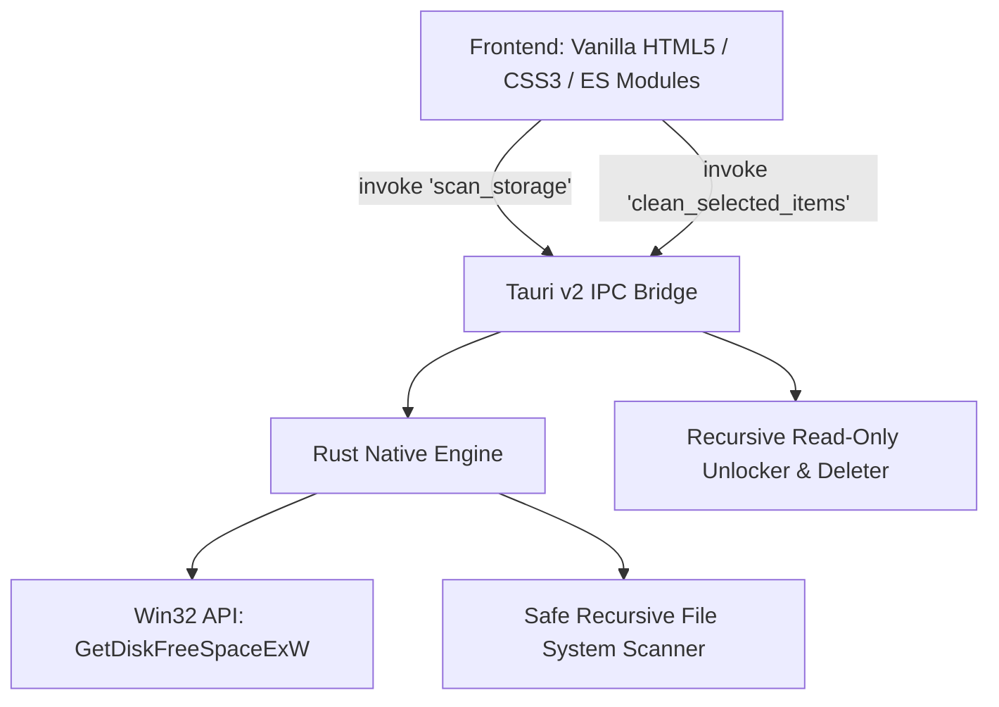

<div align="center">

# ⚡ StorageRelief

**The Next-Generation Native Windows Storage Optimizer**  
*Detect and eliminate 20 GB to 100+ GB of hidden bloatware, obsolete app versions, and cache buildup that traditional cleaners miss.*

[](https://github.com/USERNAME/StorageRelief/releases)
[](https://tauri.app)
[](https://www.rust-lang.org)
[](https://microsoft.com)
[](LICENSE)

> 📦 **Instant One-Click Install:** You don't need to compile from source! The ready-to-use Windows installer is included directly in this repository: [**`StorageRelief_Setup.exe`**](StorageRelief_Setup.exe) (3.4 MB).

</div>

---

## 💡 The Problem StorageRelief Solves

Traditional disk cleaners (like Windows Disk Cleanup or CCleaner) only touch standard browser cookies and system temp files, freeing a meager 500 MB to 2 GB. Meanwhile, modern PC usage leaves massive gigabytes of hidden waste:

- **Ghost App Versions:** Auto-updating software (e.g. CapCut, Discord, Slack) keeps 10–20 GB of dead prior version binaries in `AppData\Local`.
- **Package & Build Caches:** `npm-cache`, `pip\cache`, `uv\cache`, and `.gradle\caches` quietly balloon to 15–30 GB.
- **Forgotten Installers & Game Repacks:** Heavy downloaded `.iso`, `.zip`, and `.bin` repacks sitting indefinitely in Downloads and Desktop.
- **Developer Artifacts:** Rebuildable `node_modules`, `.venv`, and `target` directories left behind in abandoned project folders.
- **Virtual Disk Bloat:** WSL Linux (`ext4.vhdx`) and Android emulators (`data.vdi`) that grow to 30–50 GB and never shrink automatically.

**StorageRelief is purpose-built to hunt down these exact multi-gigabyte space hogs safely and swiftly.**

---

## ✨ Features at a Glance

| Category | Icon | What It Targets | Default Selection | Risk Badge |
|---|:---:|---|:---:|:---:|
| **Ghost Apps** | 👻 | Dead prior app versions retained after background auto-updates | ✅ Selected | `Safe` |
| **Caches & Temp** | ⚡ | Gradle, npm, pip, uv, and root temporary scratch spaces | ✅ Selected | `Safe` |
| **Installers & Repacks** | 📦 | Large downloads (>300 MB) such as `.iso`, `.zip`, `.msi`, `.bin` | ❌ Unchecked | `Review` |
| **Dev Junk** | 💻 | Rebuildable build output, compiled Flutter binaries, and virtual environments | ⚠️ Contextual | `Safe` / `Review` |
| **Virtual Disks** | 🎮 | WSL hard drives (`.vhdx`) and Android emulator disks (`.vdi`) | ❌ Unchecked | `Caution` |

---

## 🔒 Safe Deletion Architecture

StorageRelief operates under strict protective principles:

- **Zero-Risk Defaults:** Only provably redundant caches and dead version folders are checked by default. High-impact files require manual user consent.
- **Recursive Read-Only Unlocking:** Windows file attributes are safely stripped before deletion to prevent permission errors on stubborn cache trees.
- **NTFS Loop Guard:** Directory traversal checks `symlink_metadata` and enforces hard depth limits to prevent infinite recursion on Windows NTFS junction points.
- **Pre-Clean Inspection:** Every discovered item features a direct **"Open in File Explorer"** button so you can verify folder contents before confirming.
- **Detailed Confirmation Modal:** Shows an exact itemized list and total byte breakdown before any removal occurs.
- **Non-Panicking Logging:** Diagnostic logs are written to `%LOCALAPPDATA%\com.storagerelief.app\storage_relief.log` without risk of console-related crashes.

---

## 🏛️ Architecture & Tech Stack



- **Backend:** **Rust 2021** (Tauri v2) — Native multi-threaded disk operations, zero garbage collector pauses, minimal memory (~40 MB RAM).
- **Frontend:** **Vanilla HTML5, CSS3, Modern JavaScript** — Zero frontend framework overhead, sleek glassmorphic dark UI, circular SVG drive gauge.
- **Binary Footprint:** ~13 MB standalone portable executable / ~3.4 MB NSIS setup installer.

---

## 🚀 Quick Start & Installation

### Option 1: Direct Windows Setup (Easiest — Ready to Run!)
The official compiled installer is included directly in this repository:
- 📥 **Run Installer:** Double-click [**`StorageRelief_Setup.exe`**](StorageRelief_Setup.exe) to install StorageRelief with Start Menu and Desktop shortcuts.
- **Installer Size:** Only 3.4 MB (ultra-compact NSIS package).
- **Requirements:** 64-bit Windows 10 or 11. No compilation, Node.js, or Rust setup required!

---

### Option 2: Building from Source

#### Prerequisites
- [Node.js 18+](https://nodejs.org)
- [Rust 1.75+](https://rustup.rs) (Windows GNU or MSVC toolchain)
- Microsoft Edge WebView2 (built into Windows 10/11)

#### Steps
```powershell
# 1. Clone the repository
git clone https://github.com/USERNAME/StorageRelief.git
cd StorageRelief

# 2. Install dependencies
npm install

# 3. Launch in development mode
.\run.bat
# or via PowerShell
.\run.ps1 -Dev

# 4. Compile standalone release binary & installer
.\build.bat
# or via PowerShell
.\build.ps1
```

The compiled standalone executable and setup wizard will be generated in your project root.

---

## 📂 Project Structure

```
StorageRelief/
├── StorageRelief_Setup.exe      # 📦 Official one-click Windows Setup Installer (3.4 MB)
├── .github/
│   ├── ISSUE_TEMPLATE/
│   │   ├── bug_report.yml       # Bug report issue form
│   │   └── feature_request.yml  # Feature proposal form
│   ├── workflows/
│   │   └── release.yml          # Automated CI/CD release workflow
│   └── pull_request_template.md # PR guidelines
├── assets/                      # Graphics, icons and logo
├── src/                         # Clean UI Frontend
│   ├── index.html               # Semantic glassmorphic layout
│   ├── main.js                  # Reactive controller & IPC calls
│   └── styles.css               # Design tokens, SVG animations & styling
├── src-tauri/                   # High-Performance Rust Core
│   ├── capabilities/
│   │   └── default.json         # Tauri v2 security capabilities
│   ├── icons/                   # Multi-resolution application icons
│   ├── src/
│   │   ├── lib.rs               # Scanner, deletion engine & Win32 hooks
│   │   └── main.rs              # Windows subsystem entry point
│   ├── Cargo.toml               # Rust dependency manifest
│   ├── build.rs                 # Tauri build script
│   └── tauri.conf.json          # App window & bundle configuration
├── .gitattributes               # Line ending normalization
├── .gitignore                   # Complete Rust/Node ignore configuration
├── build.bat                    # One-click Windows build script
├── build.ps1                    # PowerShell release compiler
├── CHANGELOG.md                 # Version history & release notes
├── CONTRIBUTING.md              # Contribution guide & coding rules
├── LICENSE                      # MIT Open Source License
├── package.json                 # Project scripts & metadata
├── README.md                    # Project documentation
├── run.bat                      # One-click Windows launcher
├── run.ps1                      # Smart launcher (standalone / dev mode)
└── SECURITY.md                  # Security & safe deletion policy
```

---

## 🗺️ Roadmap

- [x] Win32 live drive storage calculation
- [x] Ghost app version detection (CapCut, etc.)
- [x] Package build cache scanner (npm, Gradle, pip, uv, Temp)
- [x] Heavy repack & installer analyzer (>300 MB)
- [x] Dev project scanner (`node_modules`, `.venv`, `target`)
- [x] Virtual machine disk auditor (MuMuPlayer `.vdi`, WSL `.vhdx`)
- [x] Glassmorphic circular drive capacity gauge & category tabs
- [x] Windows recursive read-only permission unlocker
- [ ] Duplicate video & media file finder (hash-based)
- [ ] Automated scheduled cleanup reminders
- [ ] One-click WSL hard drive compactor (`diskpart` integration)

---

## 🤝 Contributing

Contributions are warmly welcomed! Please read [CONTRIBUTING.md](CONTRIBUTING.md) to get started.

1. Fork the Project
2. Create your Feature Branch (`git checkout -b feature/AmazingDetector`)
3. Commit your Changes (`git commit -m 'feat: Add OBS recording cache cleaner'`)
4. Push to the Branch (`git push origin feature/AmazingDetector`)
5. Open a Pull Request

---

## 📄 License

Distributed under the **MIT License**. See [`LICENSE`](LICENSE) for details.

---

<div align="center">
  <sub>Built with ❤️ for every Windows user tired of running out of disk space.</sub>
</div>
